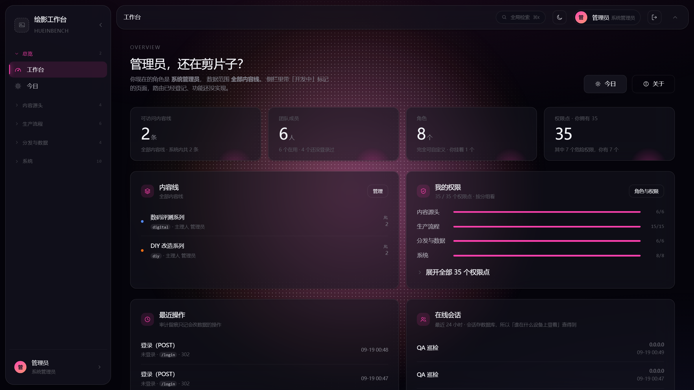
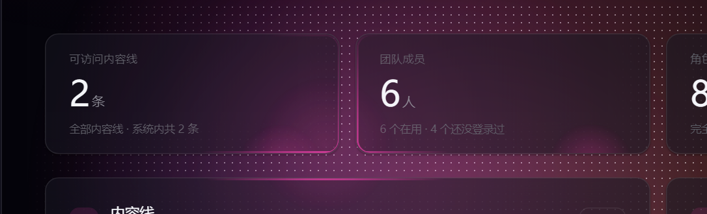
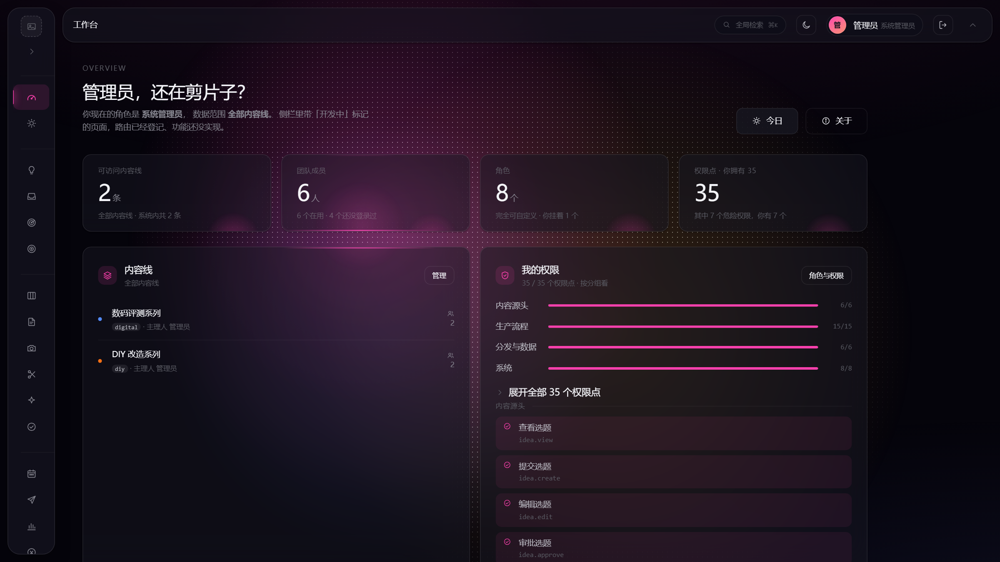
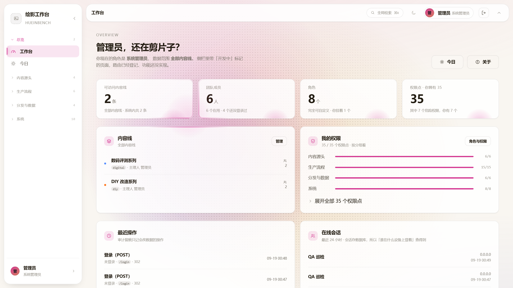

# huein-lightfield-ui-style

> **悬浮岛 + 光场** —— 一套暗色后台界面风格的复刻技能。
> 把它交给 AI，它就能按这套风格改造你的项目。



**设计语言一句话：光是指示注意力的工具，不是装饰。**

指针靠近哪个面，那个面的边缘就亮起一圈，像被一盏灯照到；
背景里有三团缓慢漂移的光和一层细密点阵，点阵被光照到的地方接近半透明，越远越淡直至消失。

<p align="center">
  
  
</p>

浅色主题是**单独调过的一整套，不是反色**（光场彩度降一档、玻璃换实色、文字加粗）：



---

## 这是什么

**不是组件库，是一份给 AI 看的设计复刻手册**，外加两个可以直接抄进项目的资产。

它来自 [绘影工作台 hueinbench](https://github.com/CODES233)（一个自媒体工作室管理系统）——
这套界面已经跑过 13 个版本迭代，手册里每一条 ⚠️ 基本都是真实踩出来的坑，不是推演出来的。

| | |
|---|---|
| 适合 | 想给后台界面加「悬浮感 / 呼吸感 / 高级感」，又不想从零调参数 |
| 适合 | 想把这套设计语言搬到自己项目上，但看不完那几百行 CSS |
| 不适合 | 需要开箱即用组件库的场景（这里没有 `<Button>`） |

## 它解决的核心问题

普通后台是「拼成一块边框盒」——侧栏靠 `border-right`、顶栏靠 `border-bottom` 连成一体。
这套风格把它拆成**两个互不接触的悬浮岛**，然后解决随之而来的一堆问题：

- 岛怎么收起来（侧栏收成图标栏、顶栏整个浮走并把纵向空间**真的**还回来）
- 首帧长什么样（解析期状态 —— 刷新后不能先闪一下再折起来）
- 光怎么不变成装饰（**距离驱动**：指针不碰卡片也亮，越近越亮；所有光响应同一个焦点）
- 动效怎么不生硬（**生硬通常出在「时序」不在曲线** —— 两个东西不同步时，要把先到位的那个按住）
- 动画残留怎么清（`animation-fill-mode: both` 的终态会让元素变成 `position: fixed` 的包含块，
  这是这套风格里最贵的一个坑）

## 快速开始

### 方式一 · 装成 AI 技能（推荐）

Claude Code / WorkBuddy 之类的 agent 都读 `SKILL.md` 这套约定，
把整个仓库目录放进技能目录即可：

```bash
git clone https://github.com/CODES233/huein-lightfield-ui-style.git \
  ~/.workbuddy/skills/huein-lightfield-ui-style
```

然后直接把 [`PROMPT.md`](PROMPT.md) 里那段提示词复制给 AI 就行。

### 方式二 · 只贴一份文本

打不开 `references/` 的场景（网页版 AI、粘贴到对话框），用 [`SKILL.full.md`](SKILL.full.md) ——
入口 + 五份参考的拼接版，整份贴进去即可。

### 方式三 · 先看效果

```
用技能 huein-lightfield-ui-style 把这句话变成一个可运行的单文件 HTML 演示页：

「一个暗色后台，左边是可收起的图标栏，顶部一条悬浮工具栏，内容区三张统计卡。
鼠标移动时卡片边缘亮起，背景有三团缓慢漂移的光，还叠着一层点阵背景。」
```

## 一键复用提示词

完整版在 [`PROMPT.md`](PROMPT.md)（含「只拿到一份文本」的变体）。最短可用版本：

```
请使用技能 huein-lightfield-ui-style，把我这个项目改造成「悬浮岛 + 光场」风格。

目标项目：[路径]        技术栈：[例如 Vite + React]
不要动的地方：[例如表单页的字段布局]

执行要求：
1. 先完整读技能根目录的 SKILL.md，再按它的「从零复刻 · 七步」执行；
2. 每一步动手之前，先读那一步指定的 references/ 文件，不要凭记忆写代码；
3. 按顺序做，不要跳步 —— 后一步假设前一步已经就位；
4. 一次只改一小块，每改完一块停下来告诉我改了什么；
5. 第 1 步（定 token）做完后先让我确认配色，再往下走；
6. 每一步做完按 references/05-verify.md 的方式自检 —— 写成断言，不要说「看起来对了」；
7. 遇到和我原有写法冲突的地方，先说明冲突和风险再改。
```

> 第 2 条和第 6 条是关键。这套风格几乎全是动效与光，
> **AI 凭印象写 CSS 会漏掉三层光的镜像关系、解析期状态这些关键点**；
> 而动效「看着对」是最容易骗人的 —— 实际常出现落地暗缝、首帧闪一下、边缘光永远不亮。

## 仓库结构

```
├── SKILL.md              入口：三条原则 · 七步流程 · 页面骨架 · 技能地图
├── references/
│   ├── 01-tokens.md      设计 token：一个 --brand-hue 派生整套配色
│   ├── 02-shell.md       悬浮岛外壳：几何 / 收起展开 / 窄屏 / 首帧 / 滚动 / 缓存
│   ├── 03-light.md       光：边缘光 / 光柱 / 点阵 / 三层光场 / 开场动画
│   ├── 04-motion.md      导航飞行 · 展开过渡 · 内容依次浮入
│   └── 05-verify.md      验收与取证：怎么写断言 · 测试脚本的坑
├── assets/
│   ├── tokens.css        ← 可直接改用（194 行）
│   └── lightfield.js     ← 光场引擎，851 行，可直接改用
├── SKILL.full.md         单文件拼接版（只贴一份文本时用）
└── PROMPT.md             给 AI 的一键复用提示词
```

**入口只有 `SKILL.md` 一个**，其余文档按需读取 —— 这样 AI 拿到一份技能就能自己往下展开，
不必一次吞下全部内容。

## 两个能直接抄的资产

| 文件 | 说明 |
|---|---|
| [`assets/tokens.css`](assets/tokens.css) | 完整设计 token。**改 `--brand-hue` 一个值就能派生整套协调配色** —— 三层光的色相、中性色、强调色全跟着走 |
| [`assets/lightfield.js`](assets/lightfield.js) | 光场引擎。四种设备模式（桌面精确指针 / 手机陀螺仪 / 手机漂移 / 关闭），三层光斑围绕焦点做镜像 |

`lightfield.js` 里的类名和 DOM 结构耦合在原项目上，抄过去需要改选择器，
但**结构与参数是这套风格的核心**，比重新写一遍省事得多。

## 三个最容易做错的地方

1. **三层光场是「围绕焦点做镜像」，不是三个固定锚点。**
   主光（品红）在焦点 · 补光（琥珀）对角镜像 · 冷光（靛紫）垂直镜像。
   写成固定锚点的后果是：三团光全挤在屏幕上方一条横带、下半屏纯黑 ——
   而且**参数都在、不报错、注释还理直气壮，看代码根本看不出错**。
2. **光由「距离」决定，不是「碰到才亮」。** 距离要用「到**矩形本身**的精确距离」
   （矩形内 = 0），不是「到中心距离 − 外接圆半径」—— 后者会让指针在下半个屏幕都被判成贴着顶栏。
3. **生硬通常出在「时序」，不在曲线。** 凡是「A 已经到位、B 还在路上」，
   调 B 的曲线永远调不好 —— 要把 **A 按住**。

## License

[MIT](LICENSE) © 2026 绘影社 HUEINMEDIA · 扣子

`assets/` 下的两个文件与绘影工作台同源（该项目以 AGPL-3.0 开源）。
本仓库作者即该项目作者，故同一份代码在此**按 MIT 另行授权**，可自由使用。
